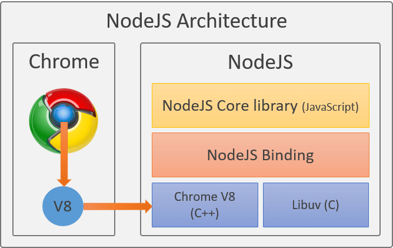

# Clase 01 - Node.js Backend

## Instalaciones necesarias.

* Visual Studio Code <https://code.visualstudio.com/>
* Git <https://git-scm.com/>
* Github <https://github.com/>
* Node <https://nodejs.org/es>

## Comprobar si tengo instalado GIT

```sh
git --version
```

## Comprobar si tengo instalado NODE y NPM

```sh
node --version
npm --version
```

## Markdown (MD)
Me permite tomar apuntes, hacer resumenes, incluir pasos de instalación del proyecto, etc

# ¿Qué es Node?
Node es un entorno de ejecución que permite correr Javascript fuera del navegador, usando el motor V8 de Chrome. 

El creador de Node es: **Ryan Dahl**

Ryan Dahl se dio cuenta del poder de Javascript con el motor V8 de Chrome entonces decidió extraer el motor del navegador.



## Motor V8 de Chrome

<https://v8.dev/>

## Motores (interpretes) de JavaScript

<https://en.wikipedia.org/wiki/List_of_JavaScript_engines>

## Gestor de paquetes (NPM)
Node Package Manager me permite gestionar las dependencias de un proyecto Node.

> Página web donde se encuentran los paquetes de Javascript

<https://www.npmjs.com/>

## Inicializar un proyecto de NODE.

```sh
npm init -y # el flag/bandera -y me permite indicarle a todo que si.
```  

> Genera un archivo llamado package.json 
Me va permitir gestionar un proyecto de NODE.

## Listar scripts que tengo

```sh
npm run
```

## Casos particulares de npm run

```sh
npm start # generalmente arranca el proyecto en producción
npm test # generalmente se utiliza para correr la bateria test
```

## ¿Qué es GIT?
Git sirve para registrar, oraganizar y controlar los cambios de un proyecto (Código fuente) a largo del tiempo. Voy a tener historial de los cambio en el tiempo.

* No perder trabajo.
* Trabajar equipo sin solaparse.
* Hacer pruebas de código sin temor.
* Saber qué cambió y cuándo.

### Inicializar un proyecto de GIT

```sh
git init # crear una carpeta oculta donde git va gestionando los cambios (.git)
```

### Ver en que estado y área se encuentra mi código

```sh
git status
```

> Estados

* Untraked -> git saber que los archivos existen pero no saber su contenido ni puede versionarlos
* Staged -> los archivos están en la zona de confirmación listos para poder hacer un commit
* traked -> Archivo ya en el repositorio local.
* modified -> Significa que entre el Working Directory y el Local Repo hay cambios

## Agregar los archivos al Staging area

```sh
git add . # Cuidado con punto en el git add porque lo que hace es agregar todos los archivos dentro del Staged
```

## Es hacer un commit con lo que se almaceno dentro del Staging Area

```sh
git commit -m "Mensaje descriptivo sobre lo que se guardo dentro de ese commit"
```

# Visual Studio Code (Extensiones)

* vscode-pdf (tomoki1207.pdf)
* Better Comments (aaron-bond.better-comments)
* Material Icon Theme (PKief.material-icon-theme)
* JavaScript (ES6) code snippets (xabikos.JavaScriptSnippets)